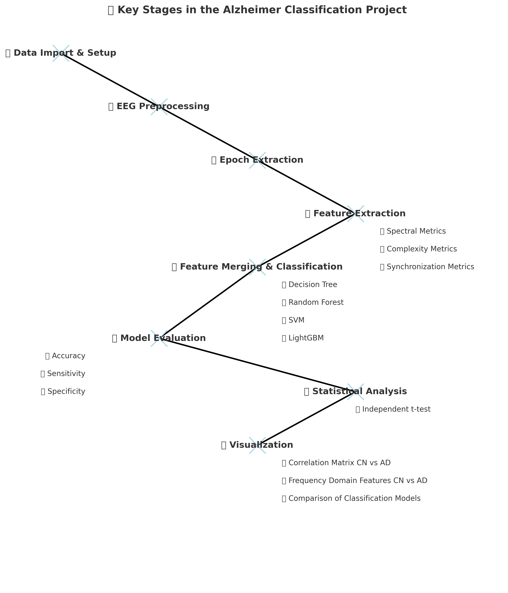

# 🧠 Data Science Final Workshop Project  
## 📊 Diagnosis of Alzheimer's Disease via Resting-State EEG  
### 🔗 Integration of Spectrum, Complexity, and Synchronization Signal Features  

---

## 📌 Project Overview  
This project aims to develop a **machine learning pipeline** for classifying **Alzheimer's Disease (AD)** using **EEG signal features**.  
📌 The workflow includes:  
✅ **Preprocessing EEG data** *(artifact removal, filtering, and re-referencing)*  
✅ **Extracting Spectral, Complexity, and Synchronization metrics**  
✅ **Training & Evaluating Classification Models** *(Decision Tree, SVM, Random Forest, LightGBM)*  
✅ **Statistical Analysis between the Groups** *(Independent T-test)* 
✅ **Visualization** *(Frequency-domain, Correlation matrix, classification models performance analysis, etc)* 

---

## 🎯 Objectives  

1️⃣ **Process raw EEG data** from **Cognitively Normal (CN)** and **Alzheimer's Disease (AD)** subjects.  
2️⃣ **Extract EEG biomarkers** from **Spectral, Complexity, and Synchronization domains**.  
3️⃣ **Train and evaluate machine learning models** to classify **AD vs CN**.  
4️⃣ **Ensure reproducibility** by providing a structured **pipeline & automation scripts**.  

---

## 🔬 Key Assumptions & Hypothesis  

📌 **EEG Distinctions in AD vs CN**  
🧠 EEG signals exhibit **distinct frequency & complexity patterns** that differentiate **AD from CN**.  

📌 **Functional Connectivity & Brain Networks**  
🔗 **Synchronization & functional connectivity metrics** capture **brain network dysfunctions** associated with AD.  

📌 **Machine Learning for AD Diagnosis**  
🤖 **ML models** can **accurately classify AD vs CN** when trained on carefully extracted EEG features.  


### Project Structure

```
EEG_Alzheimer_Classification/
│-- data/                  # Dataset directory (original + generated feature datasets)
│   ├── raw_dataset/        # EEG dataset (downloaded from OpenNeuro)
│   ├── filtered_subjects/  # Filtered EEG files
│   ├── filtered_preprocessed/  # Preprocessed EEG files
│   ├── epochs_overlap/     # Extracted EEG epochs
│   ├── spectrum_features.csv    # Spectrum feature dataset
│   ├── complexity_features.csv  # Complexity feature dataset
│   ├── synchronization_features.csv  # Synchronization dataset
│   ├── final_dataset.csv   # Combined dataset for classification
│
│-- model/                    # classification model directory 
│   ├── dt_model.pkl          # saved decision tree model
│   ├── rf_model.pkl          # saved random forest model
│   ├── svm_model.pkl         # saved support vector machine model
│   ├── lightgbm_model.pkl    # saved lightgbm model

│-- plots/                    # visualization plots directory 
│   ├── frequency_domain.png    # saved frequency domain plots for both AD and CN
│   ├── time_frequency_domain.png  # saved time-frequency domain plots for both AD and CN
│   ├── correlation_matrix.png        # saved connectivity matrix for both AD and CN
│
│-- reports/                    # report of my unit and integration test
│   ├── report.html    # html file of the test report

│-- src/                            # Python scripts for EEG processing and modeling
│   ├── preprocessing.py            # EEG Preprocessing (filtering, noise removal, ICA)
│   ├── epoch_extraction.py         # Extracting 4s epochs with 50% overlap
│   ├── spectrum_metrics_extraction.py  # Extracting frequency-domain features (PSD, power ratios)
│   ├── complexity_metrics_extraction.py  # Extracting entropy-based complexity metrics
│   ├── complexity_preprocessing_optimization #post-cleaning on the extracted complexity metrics
│   ├── synchronization_metrics_extraction.py  # Extracting brain network synchronization metrics
│   ├── classification_model.py    # Merging features, training classifiers, evaluation
│   ├── plot_viz.py               #plots frequency and time-frequency domain of AD vs CN
│   ├── statistical_test.py       #Compute independent t-tests between CN and AD groups
│   ├── logger.py                #Logging module for debugging and monitoring
│   ├── main.py                #This script runs the entire EEG pipeline from preprocessing to statistical test


│-- tests/                                      # Python scripts for performing unit and integration tests
│   ├── test_classification_model.py            # unit and integration testing for the classification pipeline
│   ├── test_complexity_metrics_extraction.py   # unit and integration testing for the complexity metrics extraction
│   ├── test_epoch_extraction.py  # unit and integration testing for the epoch extraction
│   ├── test_preprocesing.py  # unit an dintegration testing for EEG preprocessing
│   ├── test_spectrum_metrics_extraction.py #unit and integration testing for spectrum metrics extraction
│   ├── test_synchronization_metrics_extraction.py  # unit and integration testing for synchronization metrics extraction
│   
│
│-- bash.sh                 # Bash script for dataset setup and folder structure
│-- my_project.code-workspace     # VS Code workspace settings
│-- pyproject.toml                # Project metadata and dependencies
│-- README.md               # Project documentation
│-- requirements.txt         # Required dependencies for Python environment
│-- tox.ini         # Automated testing configuration
```

## 🏥 Key Stages in the Alzheimer Classification Project



### 📌 A. Data Import & Setup  
📂 **Dataset:** EEG data is obtained from **OpenNeuro**  
🔗 **Download Link:** [OpenNeuro EEG Dataset](https://openneuro.org/datasets/ds004504/versions/1.0.2/download#)  

⚙️ **Setup Process:**  
- 🏗 **Automated Structure:** `bash.sh` script sets up the dataset structure.  
- 📥 **Download Options:**  
  - **Manual Download** 🖥️  
  - **DataLad Download** 📦  

---

### 🛠️ B. EEG Preprocessing (`preprocessing.py`)  
📊 **Processing Steps:**  
✅ **Band-pass filtering** *(0.5 - 45 Hz) to remove noise*  
✅ **Independent Component Analysis (ICA)** *for artifact removal*  
✅ **Re-referencing EEG channels** *to an average reference*  
✅ **Artifact Subspace Reconstruction (ASR)** *to exclude high-amplitude segments*  
💾 **Saved Format:** **.fif** *(preprocessed EEG files are stored in this format)*  

---

### ⏳ C. Epoch Extraction (`epoch_extraction.py`)  
📌 **Epoch Processing:**  
🔹 Extracts **4-second non-overlapping** epochs *(50% overlap applied)*  
🔹 Saves each epoch as an **individual `.npy` file** for feature extraction  

---

### 📈 D. Feature Extraction  

#### 🟢 D1: Spectral Metrics (`spectrum_metrics_extraction.py`)  
📊 **Computed Metrics:**  
🔹 **Time-domain features:** *Mean, Variance, Interquartile Range (IQR)*  
🔹 **Power Spectral Density (PSD):** *Computed via Welch’s method*  
🔹 **Band-specific power:** *Delta, Theta, Alpha, Beta, Gamma*  
🔹 **Relative Band Power (RBP):** *Normalizes each band’s power against total power*  

#### 🔵 D2: Complexity Metrics (`complexity_metrics_extraction.py`)  
🧠 **Entropy-Based Metrics:**  
- Approximate Entropy (**ApEn**)  
- Sample Entropy (**SampEn**)  
- Permutation Entropy (**PermEn**)  

⚠️ **Data Cleaning:** Removes NaNs to ensure classifier compatibility  

#### 🟠 D3: Synchronization Metrics (`synchronization_metrics_extraction.py`)  
🔗 **Functional Connectivity Analysis:**  
- Pearson Correlation  
- Phase Locking Value (**PLV**)  

📊 **Graph-Based Features:**  
- **Clustering Coefficient**  
- **Characteristic Path Length**  
- **Global Efficiency**  
- **Small-Worldness**  

🧩 **Network Construction:**  
- **Top 60% of connections are thresholded** to create binary brain networks  

---

### 🤖 E. Feature Merging & Classification (`classification_model.py`)  

📌 **Steps:**  
🔹 Feature datasets *(Spectral, Complexity, Synchronization)* are **merged**  
🔹 Subjects are **labeled** *(AD = 1, CN = 0)*  
🔹 **Data Cleaning:** Removal of missing/infinite values  

---

### 📊 Machine Learning Models  
🧠 **Models Used:**  
✅ **Decision Tree** 🌳  
✅ **Random Forest** 🌲🌲  
✅ **Support Vector Machine (SVM)** 📊  
✅ **LightGBM** 💡  

---

### 🔄 Cross-Validation  
📌 **Method Used:** **GroupShuffleSplit**  
🔹 Ensures **no subject overlap** between train/test sets  

---

### 📏 Performance Metrics  
📊 **Model Evaluation Metrics:**  
📌 **Accuracy** 🎯  
📌 **Sensitivity** *(Recall for AD patients)*  
📌 **Specificity** *(Correct classification of CN individuals)*  

---

### 🧪 Statistical Test  
📌 **Independent t-test** is applied for significance testing  

---

### 📊 Visualization  
📌 **Final Analysis Plots:**  
🟣 **Correlation Matrix:** *CN vs AD*  
🟢 **Frequency Domain Features:** *CN vs AD*  
🔵 **Comparison of Classification Models**  


## 📂 Dataset Description & Source  

🔗 **Dataset:**  
📥 [**OpenNeuro EEG Dataset**](https://openneuro.org/datasets/ds004504/versions/1.0.2/download#)  

📖 **Reference Paper:**  
🔍 [**Frontiers in Aging Neuroscience**](https://www.frontiersin.org/journals/aging-neuroscience/articles/10.3389/fnagi.2023.1288295/full#ref18)  

---

### 🧠 EEG Data Overview  
👥 **Subjects:**  
- **65 total participants** *(36 AD, 29 CN)*  
- **AD = Alzheimer's Disease, CN = Cognitively Normal*  

👀 **Experimental Setup:**  
- **Resting-state EEG (eyes closed)**  
- **500 Hz sampling rate**  
- **Electrode placement:** **19 scalp electrodes (10-20 system)**  

---

### 📊 Extracted Features  
✅ **Time-domain Features:**  
   - **Mean**, **Variance**, **Interquartile Range (IQR)**  
✅ **Spectral Features:**  
   - **Power Spectral Density (PSD)** *(Welch’s Method)*  
   - **Relative Band Power (RBP)** *(Normalized Band Power)*  
✅ **Complexity Features:**  
   - **Approximate Entropy (ApEn)**  
   - **Sample Entropy (SampEn)**  
   - **Permutation Entropy (PermEn)**  
✅ **Synchronization Features:**  
   - **Functional Connectivity Metrics** *(Pearson Correlation, PLV)*  
   - **Graph-based Features** *(Clustering Coefficient, Path Length, Small-Worldness, Global Efficiency)*  


## Instructions to Run the Project

```python

### 1. Set up your virtual environment

#install virtualenv to set up your python environment
pip install virtualenv
#create your virtual environment
python -m venv venv
#activate your virtual environment- venv should appear as a prefix if successfully activated
venv\Scripts\activate # Windows
source venv/bin/activate # Linux

### 2. Setup Dataset & Folder Structure

bash bash.sh

### 3 Install projects packages 
pip install -e .

### 4. Run Individual Steps

### Preprocessing: 
run_preprocessing

### Epoch Extraction: 
run_epoch_extraction

### Complexity Metrics: 
run_complexity

### Complexity Optimization: 
run_complexity_optimization

### Spectral Metrics: 
run_spectrum

### Synchronization Metrics: 
run_synchronization

### Classification Model: 
run_classification_model

### Visualization: 
run_plot_visualization

### Statistical Analysis: 
run_statistical_analysis

### 5. Run the Complete Pipeline

run_full_pipeline

### 5. Run the test
tox

```
## 📌 Expected Output  

📂 **Processed Files & Directories:**  
📁 **Preprocessed EEG Files:** Saved in **`filtered_preprocessed/`**  
📁 **Extracted Epochs:** Stored in **`epochs_overlap/`**  

📊 **Feature Datasets:**  
📄 **Spectral Features:** `spectrum_features.csv`  
📄 **Complexity Features:** `complexity_features.csv`  
📄 **Synchronization Features:** `synchronization_features.csv`  

📌 **Final Classification Results:**  
📌 **Performance Metrics** *(Displayed in console/output file)*  
✅ **Accuracy** 🎯  
✅ **Sensitivity** *(Recall for AD patients)*  
✅ **Specificity** *(Correct classification of CN individuals)*  

